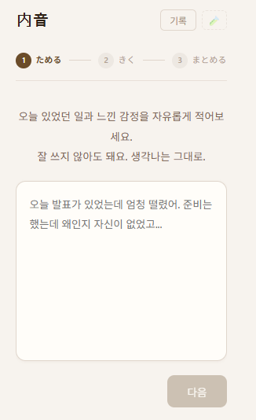
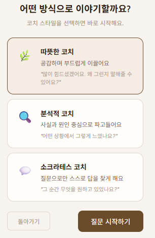
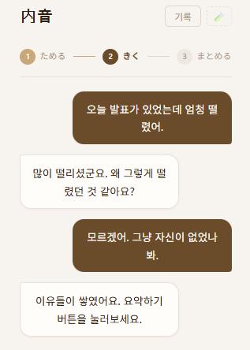
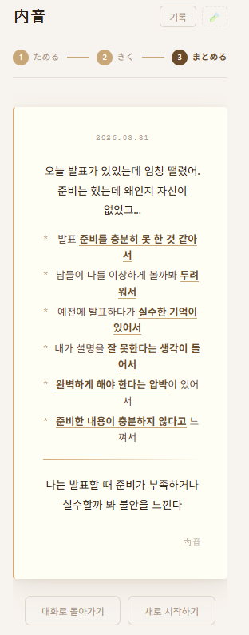
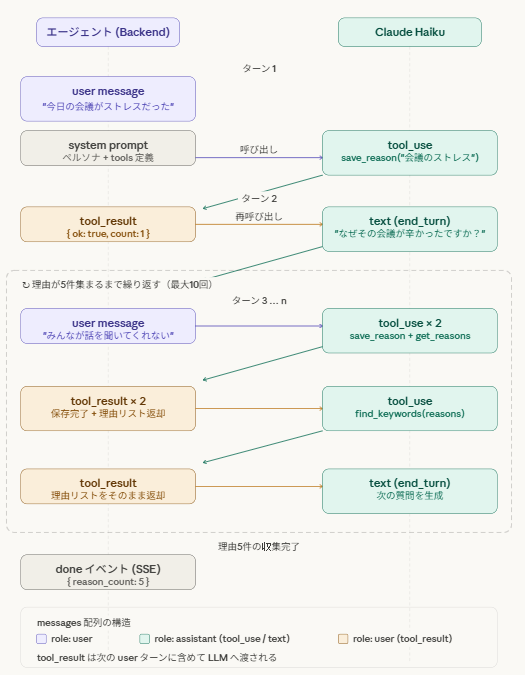

# 内音 (Naion)

**感情の原因を対話で掘り下げ、言語化を支援するAIエージェント**

> 現在のUIは韓国語のみ対応しています。多言語化は今後対応予定です。

---

## プロジェクト概要

自分の感情や考えを言葉にして整理する力は、円滑なコミュニケーションのために重要だと感じました。
出来事・感情・理由を短時間で書き出して整理する方法に着想を得て、それをノートではなくAIとの対話形式で、より続けやすくできないかと考えました。

内音は、AIとの会話を通じて感情の背景や原因を少しずつ言語化し、最後に構造化されたインサイトとして整理できるAIアプリです。

---

## 主要フロー

| Step | 名前 | 説明 |
|------|------|------|
| 1 | **ためる** | 今感じている感情や出来事を自由に入力する |
| 2 | **きく** | AIコーチが質問を返しながら、感情の背景や原因を少しずつ整理する。対話中に原因候補を内部的に保存する |
| 3 | **まとめる** | 蓄積した原因情報をもとに、AIが感情インサイトレポートを生成する |

<table>
  <tr>
    <td align="center"><br/>Step 1 · ためる</td>
    <td align="center"><br/>コーチスタイル選択</td>
    <td align="center"><br/>Step 2 · きく</td>
    <td align="center"><br/>Step 3 · まとめる</td>
  </tr>
</table>

---

## 設計のポイント

### 1. Stateless LLM
LLM単体では会話の中で見つかった感情の原因を構造的に保持できない。

### 2. Tool Calling
ユーザー入力を受けた後、すぐに応答するのではなく、必要に応じて `save_reason` などのツールを呼び出して状態を更新する。

### 3. Stateful Agent Flow
保存した reason を `get_reasons` で再参照し、次の質問や要約生成に活用する。

---

## Agent Flow



---

## Tech Stack

| Layer | Stack |
|-------|-------|
| Frontend | Vue 3 · TypeScript · Vite |
| Backend | FastAPI · Python |
| AI | Claude Haiku (対話) · Claude Sonnet (要約) |
| 通信 | SSE (Server-Sent Events) |

---

## 現在の制限事項

- 会話履歴はインメモリ保存のため、サーバー再起動で初期化される
- 認証機能は未実装
- UIは韓国語のみ対応

---

## セットアップ

**Backend**
```bash
cd backend
pip install -r requirements.txt
cp .env.example .env  # ANTHROPIC_API_KEY を入力
uvicorn main:app --reload
```

**Frontend**
```bash
cd frontend
npm install
npm run dev
```
